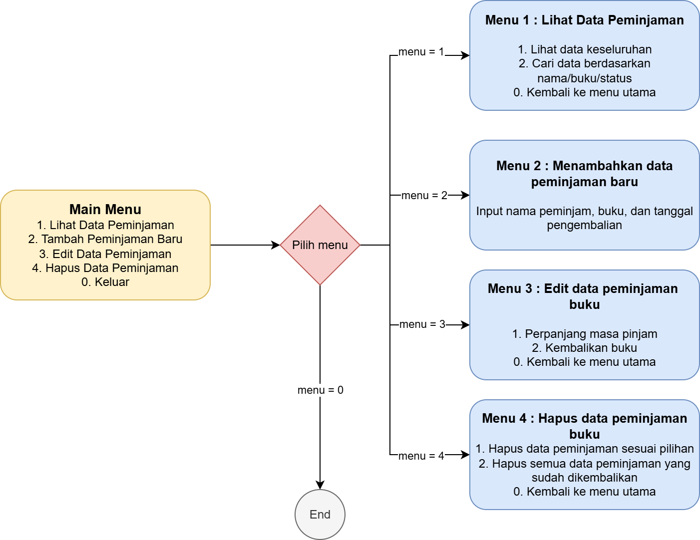

# Capstone 1 - Python Module : Pengelolaan Data Peminjaman di Perpustakaan
Program ini diperuntukan untuk pengelola perpustakaan supaya mudah dalam mengakses dan melakukan perubahan pada data peminjaman buku di perpustakaan.
Bentuk dari program ini berupa Command Line Interface (CLI) sehingga dapat dijalankan melalui terminal command line.

## Fitur Program
- Menambahkan data peminjaman buku
- Menampilkan semua data peminjaman
- Mencari data berdasarkan nama peminjam, judul buku, atau status
- Mengedit data peminjaman yang ingin diperpanjang masa pinjamnya
- Mengedit data peminjaman buku yang sudah dikembalikan
- Menghapus data buku sesuai pilihan/seluruh data buku yang sudah kembali
### Flow Program
Berikut ini adalah flowchart aplikasi yang menunjukkan garis besar alur menu dan fitur dalam program peminjaman buku perpustakaan:

Flowchart ini memvisualisasikan struktur menu utama dan submenu, termasuk fitur melihat data, menambah peminjaman, mengedit, dan menghapus data.

## Business Backgroud
Latar belakang utama dibuatnya program ini adalah untuk membantu **pengelola/admin perpustakaan** sebagai stakeholder dalam mengelola data peminjaman buku di perpustakaan.

### Tujuan Aplikasi
- Membuat data peminjaman buku menjadi lebih terstruktur
- Mempermudah proses pelacakan buku yang belum/terlambat dikembalikan
- Mengurangi potensi kehilangan buku
- Memberikan laporan terstruktur dan historis penggunaan buku

## Cara Mengakses Program
1. Pastikan anda sudah menginstal Python
2. Download atau Clone repository ini dengan masukan command ini pada terminal cmd anda. 'git clone https://github.com/celiii26/CRUD-perpus.git'
3. Lalu install library yang digunakan pada program ini dengan memasukkan command 'pip install tabulate'
4. Jika sudah, masukkan command 'cd CRUD-perpus' untuk memastikan anda sudah masuk dalam folder program ini
5. Untuk menjalankan program masukkan command 'python perpustakaan.py'

